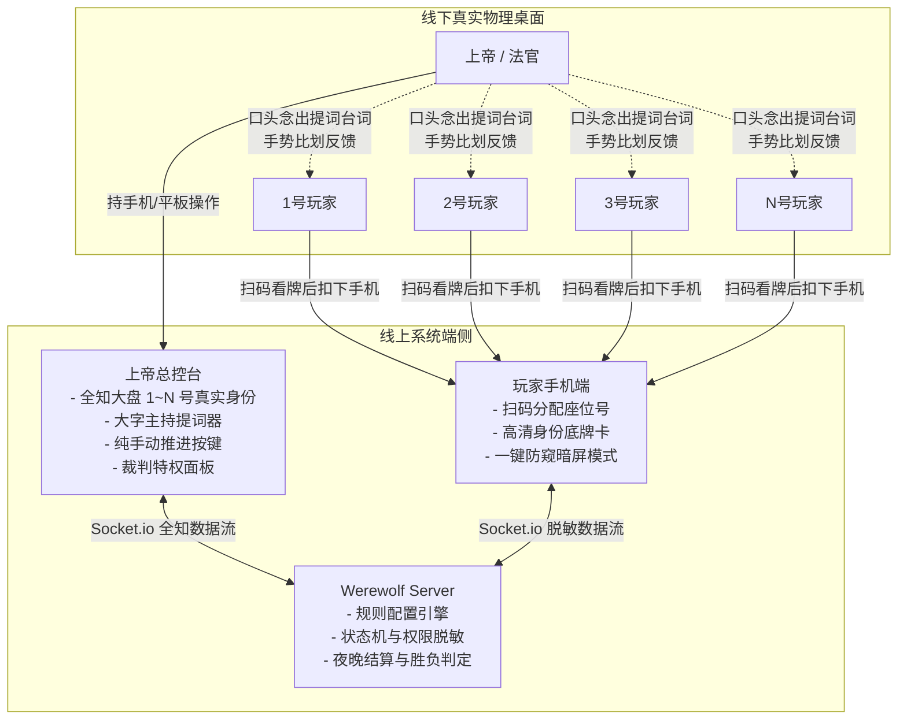
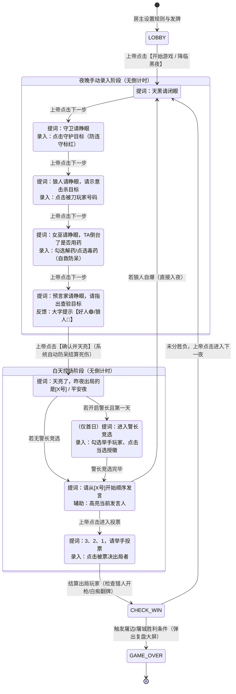

# 聚会狼人杀·线下纯手动上帝（法官）模式与主持发言系统设计方案

## 1. 概述与背景

### 1.1 现状与痛点
现有聚会狼人杀虽然支持多人联机，但在线下聚会（面对面围坐一桌）玩狼人杀时存在以下痛点：
1. **实体牌携带与洗牌麻烦**：线下玩家常未携带实体卡牌，或洗牌分发易造成磨损、底牌暴露；
2. **法官记牌与结算负担重**：线下法官（上帝）需要记忆各玩家号码、真实身份、女巫用药情况、守卫守护历史，极易出现错记、误判（如忘记女巫第几夜用了解药、同守同救判定错误等）；
3. **忘词与主持口误**：法官由于紧张或不熟悉规则，在夜间睁眼闭眼、白天宣布死讯时容易磕巴、忘词或口误暴露信息；
4. **强制倒计时破坏线下节奏**：线上游戏的自动倒计时机制极不适合线下聚会——线下玩家发言长短不一、夜晚手势沟通耗时多变，强制倒计时会导致系统过早自动切入下一阶段，打乱现场节奏。

### 1.2 核心目标
打造一款专为**真实线下聚会**量身定做的“**纯手动上帝掌中宝**”系统：
* **免实体牌扫码入座**：玩家手机扫码即看身份，随后可一键暗屏扣放手机；
* **上帝全知控制台**：房主作为全知法官，手持手机/平板纵览全场 1~N 号玩家底牌与生死状态；
* **无倒计时·纯手动推进**：彻底摒弃倒计时，由上帝在线下根据玩家实际手势与发言，手动点击【下一步】推进节奏；
* **深度自由规则板子定制**：支持预设经典板子（6人/9人/10人/12人预女猎守白等）与自由微调，支持女巫自救、警长竞选、屠边/屠城、遗言规则深度开关；
* **大字上帝发言提词卡**：各阶段置顶展示标准主持台词，动态填入真实死者编号与战报，上帝直接照着念即可；
* **逻辑防呆与自动结算**：系统自动计算狼刀、女巫双药、守卫同守同救奶穿、猎人开枪资格判定与胜负检测，彻底解放法官大脑。

---

## 2. 角色定位与端侧交互模型



### 2.1 上帝端（法官专属控制台）
* **不计入游戏卡位**：创建房间时勾选【上帝（法官）主持模式】（`isGodMode: true`），上帝不占玩家席位，不发给普通身份卡。
* **全知座位大盘**：直观展示 1~N 号玩家的物理座次、昵称、真实角色卡（🐺狼人/🧑平民/🔮预言家/🧙‍♀️女巫/🏹猎人/🛡️守卫/🃏白痴）、存活状态、警长标识、技能消耗记录。
* **大字提词器（Script Prompter）**：顶部卡片醒目高亮展示当前环节的标准念白台词，字体大，支持昏暗光线下清晰辨识。
* **纯手动控制**：提供【确认并叫下一位】、【确认并结算天亮】、【修改本夜操作】等手动按钮，绝无自动倒计时中断。
* **裁判特权**：支持随时手动裁决指定玩家出局（自爆、违规惩罚）、手动移交/撕毁警徽、一键重新发牌。

### 2.2 普通玩家端（极简防窥看牌）
* **座位对齐**：进入房间后按次序分配 1~N 号，上帝可在线下微调顺序对齐物理坐席。
* **高清底牌卡**：开局展示自身角色卡牌、所属阵营目标、详细技能说明。
* **一键防窥暗屏模式**：玩家看完牌后点击“扣下身份”，屏幕变成接近纯黑或极简锁屏状态，避免夜间屏幕反光在实体桌上暴露身份。
* **严格信息隔离**：结算前普通玩家端绝对无法查看到其他任何玩家的真实身份。

---

## 3. 规则设置与板子自定义系统

上帝在房间准备大厅可随时点击【规则设置】，包含两大模块：

### 3.1 角色板子配置 (Deck Configuration)
* **标准预设板子一键套用**：
  * **6人娱乐局**：2狼人 + 2村民 + 预言家 + 女巫
  * **9人标准局**：3狼人 + 3村民 + 预言家 + 女巫 + 猎人
  * **10人进阶局**：3狼人 + 3村民 + 预言家 + 女巫 + 猎人 + 守卫（或白痴）
  * **12人标准竞技局**：4狼人 + 4村民 + 预言家 + 女巫 + 猎人 + 白痴/守卫
  * *(注：若为一夜终极狼人杀模式，则套用经典一夜板子与 3 张桌中底牌)*
* **自由自由增减 (Custom Roles)**：
  * 上帝可通过 `+` / `-` 灵活调整角色配比：
    * 狼人阵营：普通狼人（`WEREWOLF`）、狼王/白狼王（`WHITE_WOLF`）
    * 神职阵营：预言家（`SEER`）、女巫（`WITCH`）、猎人（`HUNTER`）、守卫（`GUARD`）、白痴（`IDIOT`）
    * 村民阵营：普通村民（`VILLAGER`）
  * **发牌防呆校验**：系统实时校验卡牌总数必须严格等于参战玩家数（排除上帝自身）。

### 3.2 细节规则选项 (Rule Options)
| 规则键名 | 选项值 | 含义说明 | 默认推荐 |
| :--- | :--- | :--- | :--- |
| `witchSelfSave` | `FIRST_NIGHT_ONLY`<br/>`NEVER`<br/>`ALWAYS` | 仅首夜可自救（标准竞技赛制）<br/>全程不可自救（高压局）<br/>随时可自救（新手娱乐） | `FIRST_NIGHT_ONLY` |
| `witchDoublePotion` | `false`<br/>`true` | 单夜不可同时使用两瓶药（标准）<br/>允许单夜解药与毒药同用 | `false` |
| `guardWitchConflict` | `DIE`<br/>`SURVIVE` | 奶穿：同时被守且被救则判定死亡<br/>双重保护：依然存活 | `DIE` |
| `hasSheriff` | `true`<br/>`false` | 开启警长竞选（1.5票权、归票权、警徽流）<br/>不设警长 | `true` |
| `winCondition` | `KILL_SIDE`<br/>`KILL_ALL` | 屠边：杀光村民或杀光神职获胜<br/>屠城：杀光所有好人（神+民）获胜 | `KILL_SIDE` |
| `lastWordsRule` | `FIRST_NIGHT_AND_DAY`<br/>`ALL`<br/>`NONE` | 仅首夜出局及所有白天被票决出局有遗言<br/>所有出局者均有遗言<br/>全程无遗言 | `FIRST_NIGHT_AND_DAY` |

---

## 4. 上帝发言提词与夜晚纯手动推进状态机

### 4.1 零倒计时状态流转图



### 4.2 步骤提词与控制台操作映射

#### 步骤 1：入夜准备 (`NIGHT_FALL`)
* **上帝大字台词**：
  > “天黑请闭眼。请所有玩家低下头，闭上眼睛，不要发出任何声音。”
* **上帝界面操作**：确认全场闭眼后，点击【下一步：守卫睁眼 / 狼人睁眼】。

#### 步骤 2：守卫睁眼 (`NIGHT_GUARD`) *(若板子包含守卫)*
* **上帝大字台词**：
  > “守卫请睁眼。守卫请示意你今晚要守护的玩家号码……（等待守卫手势）……守卫请闭眼。”
* **上帝界面操作**：
  * 展示 1~N 号存活玩家，上一夜被守玩家**自动置灰并标红提示“不可连守”**；
  * 上帝点击守护号码（或选择【空守】），点击【确认并下一步】。

#### 步骤 3：狼人睁眼 (`NIGHT_WOLF`)
* **上帝大字台词**：
  > “狼人请睁眼。狼人请互认同伴……请比划手势示意今晚要击杀的玩家号码……（确认狼人手势）……狼人请闭眼。”
* **上帝界面操作**：
  * 界面高亮显示所有狼人玩家编号，供法官核对是否均已睁眼；
  * 上帝点击被击杀的玩家号码（例如点击“3号”），点击【确认并下一步】。

#### 步骤 4：女巫睁眼 (`NIGHT_WITCH`)
* **上帝大字台词**：
  > “女巫请睁眼。今晚 TA 倒台了（上帝手势向女巫示意被刀号码），你有一瓶解药要使用吗？……（等待反应）……你有一瓶毒药要使用吗？……女巫请闭眼。”
* **上帝界面操作**：
  * **解药区域**：若解药可用，显示【救活 [X号]】开关；若本局不符合自救规则且女巫被刀，系统自动置灰并注明“不可自救”防呆；
  * **毒药区域**：若毒药可用，提供 1~N 号列表供点选下毒目标（若不用药则保持未选择）；
  * 点击【确认并下一步】。

#### 步骤 5：预言家睁眼 (`NIGHT_SEER`)
* **上帝大字台词**：
  > “预言家请睁眼。请指出你今晚想要查验的玩家号码……（预言家手势示意）……TA 的身份是这个（上帝手势反馈好人向上/狼人向下）……预言家请闭眼。”
* **上帝界面操作**：
  * 上帝点击预言家所指号码，控制台**即刻弹出超大字反馈：【好人 🟢】或【狼人 🔴】**；
  * 上帝比划手势给预言家后，点击【确认并结算天亮】。

### 4.3 自动防呆死伤结算算法
当上帝点击【确认并结算天亮】时，服务端自动运行结算引擎：
1. **基础结算**：
   * 若 `狼刀目标 == 守卫目标`，狼刀被守卫抵消；
   * 若 `女巫开解药救狼刀目标`：
     * 若同时开启奶穿（`guardWitchConflict == 'DIE'`）且该目标被守卫守护，判定该目标**死亡**；
     * 否则，判定救活成功；
   * 若女巫使用毒药，毒杀目标加入死亡列表；
2. **死者汇总**：
   * 生成 `deadList`：空数组（平安夜）、1人死亡（单死）、2人死亡（双死）；
3. **特殊角色状态标记**：
   * **猎人**：若死者中包含猎人，且致死原因不包含女巫毒杀（毒死不可开枪），控制台标记【猎人可开枪】；若被毒死则标记【被毒杀，不可开枪】。

---

## 5. 白天流程、警长竞选与裁判特权

### 5.1 天亮公布死讯与遗言
* **动态战报台词**：
  * 平安夜：*“天亮了，大家请睁眼。昨夜是——平安夜！”*
  * 单人出局：*“天亮了，大家请睁眼。昨夜出局的玩家是 [3号玩家]，请发表遗言（或：无遗言）。”*
  * 双死：*“天亮了，大家请睁眼。昨夜出局的玩家是 [3号玩家] 和 [7号玩家]。”*
* **猎人带人操作**：
  * 若猎人可开枪，控制台弹窗提供【猎人开枪带人】选择框，上帝询问猎人意愿后点击带走目标，目标当场出局。
* 遗言发表完毕，上帝点击【下一步】。

### 5.2 警长竞选（首日若规则开启）
* **台词提示**：*“现在进入警长竞选环节，请竞选警长的玩家举手示意。”*
* **上帝操作**：
  * 在界面上勾选举手上警的玩家号码（支持中途退水）；
  * 台词提示：*“请从上警玩家 [X号] 开始顺时针/逆时针依次发言…”*；
  * 线下表决后，上帝点击当选者头像，赋予【⭐警长】徽章（投票时计 1.5 票）。

### 5.3 白天讨论与突发自爆
* **无倒计时**：现场发言自由，上帝可点击指定玩家号码，界面高亮标记【当前发言人】，辅助视线聚焦。
* **狼人自爆裁判特权**：
  * 线下若有狼人翻牌自爆，上帝点击控制台【X号狼人自爆】；
  * 系统判定该狼人出局，**瞬间跳过白天发言与投票，全场直接闭眼进入下一夜**！

### 5.4 公投放逐与白痴判定
* **放逐提词**：*“发言结束，所有存活玩家请准备，3、2、1，请举手投票！”*
* **上帝极简录入**：线下举手统计完毕后，上帝直接点击【被票决出局的玩家号码】（如点击“5号”）。
* **白痴翻牌逻辑**：若被票决出局者为白痴，系统自动触发【白痴翻牌免死】，保留其后续白天的发言权，但永久剥夺其投票权。

### 5.5 胜负判定与全盘复盘
* 每次死人时，系统根据所选规则判定胜负：
  * **屠边模式**：全部平民出局（狼人胜）或全部神职出局（狼人胜）或全部狼人出局（好人胜）；
  * **屠城模式**：全部好人（民+神）出局（狼人胜）或全部狼人出局（好人胜）；
* 触发胜利时，上帝端弹出结算卡片，给出终场台词：*“游戏结束！本局获胜的阵营是——[好人阵营 / 狼人阵营]！”*
* 上帝点击【公开复盘】，全员手机解除数据脱敏，展示全盘身份卡与夜间操作日志。

---

## 6. 数据模型与通讯协议定义

### 6.1 房间数据结构 (`Room State`)
```javascript
{
  code: "8899",
  hostId: "p_god_01",
  settings: {
    isGodMode: true,             // 是否开启上帝模式
    mode: "CLASSIC",             // 'CLASSIC' (经典) 或 'ONE_NIGHT' (一夜)
    boardPreset: "10_STANDARD",  // 预设板子标识
    customRoles: {               // 自定义角色卡组配比
      WEREWOLF: 3,
      VILLAGER: 3,
      SEER: 1,
      WITCH: 1,
      HUNTER: 1,
      GUARD: 1
    },
    witchSelfSave: "FIRST_NIGHT_ONLY", // 自救规则
    witchDoublePotion: false,          // 同夜双药
    guardWitchConflict: "DIE",         // 同守同救奶穿
    hasSheriff: true,                  // 警长竞选
    winCondition: "KILL_SIDE",         // 屠边 vs 屠城
    lastWordsRule: "FIRST_NIGHT_AND_DAY"
  },
  gameState: {
    phase: "NIGHT_GUARD",        // 当前阶段
    round: 1,                    // 当前第几天/夜
    sheriffPlayerId: null,       // 当前警长ID
    currentSpeakerId: null,      // 当前发言人ID
    currentSpeechScript: "",     // 当前阶段上帝标准念白台词
    // 夜间操作暂存
    nightRecord: {
      guardTarget: null,         // 守卫今晚目标
      lastGuardedTarget: null,   // 守卫昨晚目标（防连守）
      wolfTarget: null,          // 狼刀目标
      witchSaveUsed: false,      // 本局女巫解药是否已消耗
      witchPoisonUsed: false,    // 本局女巫毒药是否已消耗
      witchSaveTarget: null,     // 今晚解药目标
      witchPoisonTarget: null,   // 今晚毒药目标
      seerTarget: null,          // 今晚查验目标
      seerResult: null           // 'GOOD' | 'WEREWOLF'
    },
    // 白天记录
    dayRecord: {
      deadTonight: [],           // 今夜出局者列表
      executedToday: null        // 白天被公投出局者
    },
    executedPlayers: [],
    winnerTeam: null
  }
}
```

### 6.2 Socket.io 核心事件列表
| 事件名 | 发送方 | 接收方 | 携带参数 | 功能说明 |
| :--- | :--- | :--- | :--- | :--- |
| `god_update_rules` | 上帝 | 服务端 | `{ roomCode, settings }` | 上帝保存板子配置与细节规则 |
| `start_game` | 上帝 | 服务端 | `{ roomCode }` | 开局分发身份，入夜并下发首个台词 |
| `god_night_step` | 上帝 | 服务端 | `{ roomCode, step, actionData }` | 上帝录入守卫/狼人/女巫/预言家操作并推进 |
| `god_announce_dawn` | 上帝 | 服务端 | `{ roomCode }` | 上帝触发天亮结算，生成死讯战报台词 |
| `god_sheriff_action` | 上帝 | 服务端 | `{ roomCode, action, targetId }` | 警长参选、退水、当选授徽、移交警徽 |
| `god_select_speaker` | 上帝 | 服务端 | `{ roomCode, playerId }` | 上帝标记当前发言人，更新提词 |
| `god_wolf_explode` | 上帝 | 服务端 | `{ roomCode, wolfPlayerId }` | 狼人自爆，直接跳过白天入夜 |
| `god_vote_execute` | 上帝 | 服务端 | `{ roomCode, targetPlayerId }` | 上帝录入白天公投出局者 |
| `god_judge_eliminate`| 上帝 | 服务端 | `{ roomCode, targetPlayerId, reason }`| 法官裁判特权直接淘汰违规玩家 |
| `god_redeal` | 上帝 | 服务端 | `{ roomCode }` | 保持房间重新洗牌发牌 |

---

## 7. 异常处理与断线恢复机制

1. **线下手滑纠错与撤销**：
   * 上帝在各个环节点击目标后，在确认进入下一环节前，界面随时提供【清除/重选】；
   * 在天亮公布死讯前，常驻【修改本夜操作】按键，法官可退回上一角色重新更正。
2. **毫秒级断线状态同步**：
   * 当用户或上帝手机锁屏唤醒或刷新时，客户端以 `playerId` 和 `roomCode` 自动重连；
   * 服务端自动识别身份：上帝端毫秒级恢复全知大盘、进行中的环节与提词；玩家端保持底牌状态，杜绝对局中断。
3. **一键防窥唤醒**：
   * 玩家手机进入极暗防窥模式后，轻触屏幕任意位置即可显示“轻触唤醒查看身份”，再次点击即可展开，避免在桌上被误碰长亮。

---

## 8. 测试与质量验证方案

开发完成后，建立全套端到端自动化测试脚本 `test_werewolf_god_mode.js`，基于 Socket.io 客户端对全生命周期进行严格验证：
1. **用例 1：房间与规则定制校验**：验证开启上帝模式、设置板子（10人预女猎守、屠边、首夜自救、有警长）的保存与全员同步；
2. **用例 2：发牌与全知视角隔离校验**：验证上帝能看到全部 10 张牌，普通玩家绝对看不到其他玩家牌；
3. **用例 3：夜间全流程手动推进与提词生成**：模拟守卫守人（连守防呆校验）➔ 狼刀 ➔ 女巫救/毒（自救防呆校验）➔ 预言家查验并获取反馈；
4. **用例 4：天亮自动结算算法验证**：验证解药免死为平安夜、同守同救奶穿死亡、猎人可开枪标记；
5. **用例 5：白天警长竞选与公投**：验证授徽 1.5 票权、公投出局、白痴免死逻辑；
6. **用例 6：胜负条件触发**：验证屠边（杀光所有神或所有民）与屠城（杀光全部好人）时的自动结算与复盘解锁；
7. **用例 7：狼人自爆与裁判特权**：验证狼人自爆立即跳白天入夜、法官裁判强踢；
8. **用例 8：断线重连恢复**：验证上帝与普通玩家断网重连后的状态无损还原。
