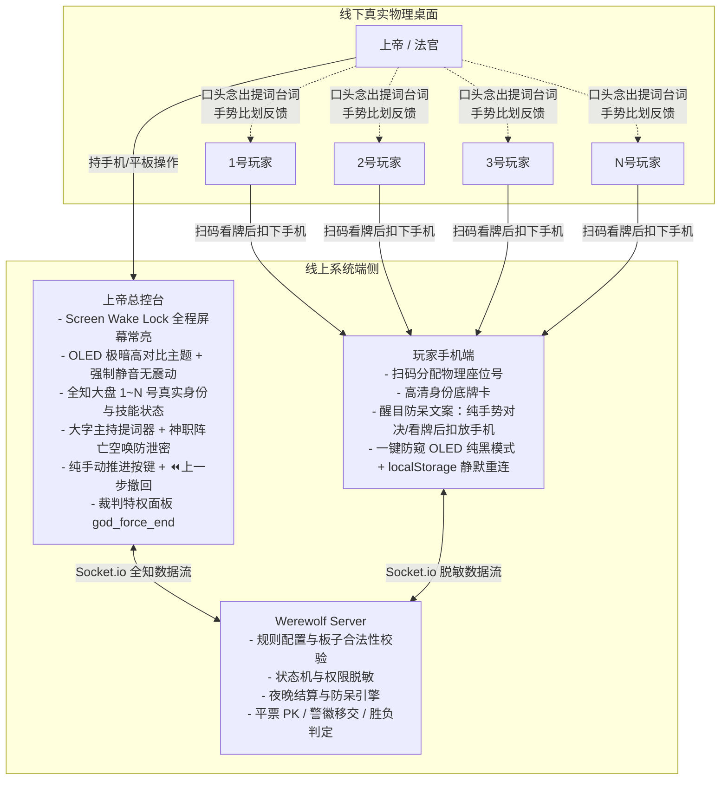
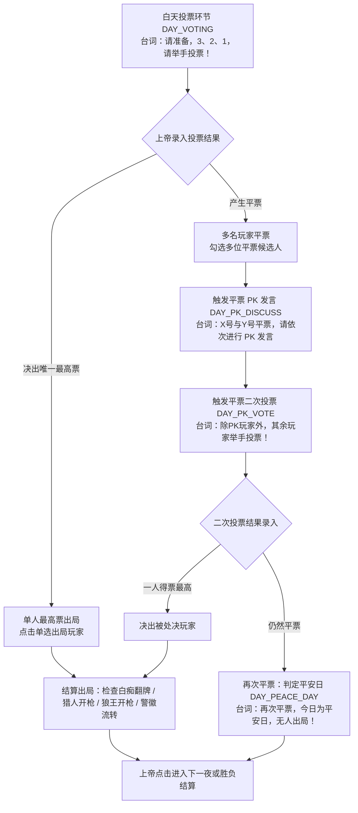

# 聚会狼人杀·线下纯手动上帝（法官）模式与主持发言系统设计方案（修订版）

## 1. 概述与背景

### 1.1 现状与痛点
现有聚会狼人杀虽然支持多人联机，但在线下聚会（面对面围坐一桌）玩狼人杀时存在以下痛点：
1. **实体牌携带与洗牌麻烦**：线下玩家常未携带实体卡牌，或洗牌分发易造成磨损、底牌暴露；
2. **法官记牌与结算负担重**：线下法官（上帝）需要记忆各玩家号码、真实身份、女巫用药情况、守卫守护历史，极易出现错记、误判（如忘记女巫第几夜用了解药、同守同救判定错误等）；
3. **忘词与主持口误**：法官由于紧张或不熟悉规则，在夜间睁眼闭眼、白天宣布死讯时容易磕巴、忘词或口误暴露信息；
4. **强制倒计时破坏线下节奏**：线上游戏的自动倒计时机制极不适合线下聚会——线下玩家发言长短不一、夜晚手势沟通耗时多变，强制倒计时会导致系统过早自动切入下一阶段，打乱现场节奏；
5. **线下物理泄密风险**：神职死亡后法官若直接跳过其夜晚睁眼步骤，会立刻向狼人暴露神职死讯；手机屏幕超时熄屏、提示音或震动更是严重的场外信息源。

### 1.2 核心目标
打造一款专为**真实线下聚会**量身定做的“**纯手动上帝掌中宝**”系统：
* **免实体牌扫码入座**：玩家手机扫码即看身份，随后可一键暗屏扣放手机，断线熄屏自动静默恢复；
* **上帝全知控制台**：房主作为全知法官，手持手机/平板纵览全场 1~N 号玩家底牌、生死与警徽状态；
* **无倒计时·纯手动推进**：彻底摒弃倒计时，由上帝在线下根据玩家实际手势与发言，手动点击【下一步】推进节奏；
* **大字发言提词器 + 空唤防泄密机制**：各阶段置顶展示标准主持台词，神职阵亡时展示“⚠️ 空唤防泄密”提示与置灰操作，杜绝法官跳过环节暴露死讯；
* **严谨的线下赛事规则**：解耦白狼王与狼王、支持首日警长竞选时序开关（先竞选后报死 / 先报死后竞选）、投票平票 PK 与二次投票、警徽强制流转阻断弹窗；
* **极致物理防泄密与裁判兜底**：集成 Screen Wake Lock 常亮、全局纯黑 OLED 暗黑主题、前端强制静音无震动、夜间常驻【⏪ 上一步】撤回、`god_force_end` 强制终局裁决。

---

## 2. 角色定位与端侧交互模型



### 2.1 上帝端（法官专属控制台）
* **不计入游戏卡位**：创建房间时勾选【上帝（法官）主持模式】（`isGodMode: true`），上帝不占玩家席位，不发给普通身份卡。
* **物理防熄屏与防泄密**：
  * **Screen Wake Lock API**：控制台自动请求 `navigator.wakeLock.request('screen')` 保持屏幕全程常亮，并在页面切换回前台时自动重新申请；提供不支持时的降级提醒，杜绝法官中途频繁触屏点亮造成的反常动作。
  * **强制静音与无震动**：全面切断所有操作音效与 `navigator.vibrate` 震动，确保法官手机在操作时全无声响动静。
  * **OLED 暗黑高对比度**：采用 `#000000` 纯黑底色与高对比文字，在昏暗包厢中既清晰易读，又杜绝大面积白光映亮法官面部导致信息泄密。
* **全知座位大盘**：直观展示 1~N 号玩家物理座次、真实角色、存活状态、警长标识、技能消耗记录。
* **大字提词器（Script Prompter）**：顶部卡片醒目高亮展示当前环节标准念白台词（字号 $\ge 20\text{px}$）。
* **纯手动控制与撤回**：提供【确认并叫下一位】、【确认并结算天亮】；夜间各步骤常驻【⏪ 上一步】按钮，允许在天亮前随时回退修正录入。
* **裁判特权面板**：支持随时手动裁决出局（自爆、违规惩罚）、手动移交/撕毁警徽、一键重新发牌、以及 `god_force_end` 强制终局。

### 2.2 普通玩家端（极简防窥看牌）
* **座位对齐与断线重连**：进入房间分配 1~N 号；玩家 `playerId` 与 `roomCode` 自动写入 `localStorage`，熄屏唤醒或意外刷新时自动发起静默重连握手，毫秒级还原底牌。
* **高清底牌卡与醒目防呆文案**：
  * 开局展示自身角色卡牌、所属阵营、技能详细说明；
  * 屏幕顶部显眼黄色卡片提示：**“⚠️ 本局为线下纯手势对决，看牌后请扣下手机。夜间行动全凭法官口令闭眼手势示意，严禁低头看手机！”**
* **一键防窥 OLED 纯黑模式**：玩家点击“扣下身份”或看牌 5 秒后，屏幕自动进入接近完全断电纯黑状态，轻触屏幕任意位置可重新唤醒。
* **严格信息隔离**：结算复盘前，普通玩家端收到的数据包中绝对不包含除自己外的任何玩家角色字段。

---

## 3. 规则设置与板子自定义系统

### 3.1 角色定义与解耦 (Role Definitions)
解耦特殊狼人角色，使其具备清晰正交的技能属性：

| 角色 ID | 角色名称 | 阵营 | 核心专属技能与规则细节 |
| :--- | :--- | :--- | :--- |
| `WEREWOLF` | 普通狼人 | 狼人阵营 | 夜晚与同伴共同商议并确定击杀目标；白天发言阶段可随时自爆（自爆直接入夜，无额外带人技能）。 |
| `WHITE_WOLF` | 白狼王 | 狼人阵营 | **自爆带人**：在白天自由发言阶段，白狼王可翻牌自爆并**强行带走场上任意 1 名存活玩家**，两人同时出局，白天立即中止并直接强制入夜。*(注：若被投票处决或夜间出局，不可发动带人技能)*。 |
| `WOLF_KING` | 狼王（枪狼） | 狼人阵营 | **出局开枪**：当狼王出局时（被公投出局、被猎人开枪带走、被自爆带走），**可发动技能开枪带走 1 名存活玩家**；**若被女巫毒死，则被闷死不可开枪**（技能机制与猎人完全对称）。自爆时不具备带人能力。 |
| `SEER` | 预言家 | 好人神职 | 夜晚每轮可查验一名玩家，上帝屏幕反馈好人/狼人。 |
| `WITCH` | 女巫 | 好人神职 | 拥有一瓶解药与一瓶毒药，受自救规则与同夜双药规则限制。 |
| `HUNTER` | 猎人 | 好人神职 | 出局时可开枪带人，被女巫毒死不可开枪。 |
| `GUARD` | 守卫 | 好人神职 | 每晚守护一名玩家免遭狼刀，不可连续两晚守护同一人；与女巫解药交互遵循奶穿规则。 |
| `IDIOT` | 白痴 | 好人神职 | 白天被投票处决时翻牌免死，保留发言权但永久失去投票权。夜间吃刀正常死亡。 |
| `VILLAGER` | 普通村民 | 好人平民 | 无夜间技能，依靠白天逻辑与投票。 |

### 3.2 角色板子配置与合法性校验 (Board Configuration)
* **标准预设板子一键套用**：
  * **6人娱乐局**：2狼人 + 2村民 + 预言家 + 女巫
  * **9人标准局**：3狼人 + 3村民 + 预言家 + 女巫 + 猎人
  * **10人进阶局**：3狼人 + 3村民 + 预言家 + 女巫 + 猎人 + 守卫（或白痴）
  * **12人标准竞技局（预女猎白）**：4狼人（可含白狼王或狼王） + 4村民 + 预言家 + 女巫 + 猎人 + 白痴
  * **12人标准守卫局（预女猎守）**：4狼人 + 4村民 + 预言家 + 女巫 + 猎人 + 守卫
* **自由自由增减配置**：上帝可通过 `+` / `-` 自由搭配狼、神、民数量。
* **`validateBoardSettings` 强防呆校验逻辑**：
  1. **人数校验**：配置总卡牌数必须严格等于参战普通玩家总数（排除上帝）；
  2. **狼人占比校验**：狼人阵营总人数必须严格小于参战总人数的一半（$\text{狼人数} < \text{总人数} / 2$）；
  3. **好人阵营平衡校验**：村民数量 $\ge 1$，神职数量 $\ge 1$。

### 3.3 细节规则选项 (Fine-grained Rule Options)
| 规则键名 | 选项值 | 含义说明 | 默认推荐 |
| :--- | :--- | :--- | :--- |
| `firstDaySheriffTiming` | `BEFORE_DEATH_ANNOUNCE`<br/>`AFTER_DEATH_ANNOUNCE` | **首日先竞选警长，再宣布昨夜死讯与遗言**（标准竞技赛制，防自爆吞警徽）<br/>**首日先宣布死讯与遗言，再竞选警长**（娱乐赛制） | `BEFORE_DEATH_ANNOUNCE` |
| `hasSheriff` | `true`<br/>`false` | 开启警长竞选（1.5 票权、归票发言、警徽流转）<br/>关闭警长竞选 | `true` |
| `witchSelfSave` | `FIRST_NIGHT_ONLY`<br/>`NEVER`<br/>`ALWAYS` | 仅首夜可自救（标准赛制推荐）<br/>全程不可自救（高压局）<br/>全程均可自救（新手局） | `FIRST_NIGHT_ONLY` |
| `witchDoublePotion` | `false`<br/>`true` | 单夜不可同时使用解药与毒药（标准）<br/>允许单夜双药同用 | `false` |
| `guardWitchConflict` | `DIE`<br/>`SURVIVE` | 奶穿：同时被守且被救则判定死亡（标准）<br/>同守同救依然存活 | `DIE` |
| `winCondition` | `KILL_SIDE`<br/>`KILL_ALL` | 屠边：杀光全部村民 或 杀光全部神职即获胜<br/>屠城：杀光所有好人（神+民）方获胜 | `KILL_SIDE` |
| `lastWordsRule` | `FIRST_NIGHT_AND_DAY`<br/>`ALL`<br/>`NONE` | 仅首夜出局及所有白天出局者有遗言<br/>所有出局者均有遗言<br/>全程无遗言 | `FIRST_NIGHT_AND_DAY` |

---

## 4. 上帝发言提词与夜晚纯手动推进状态机

### 4.1 零倒计时状态流转图（含警长竞选双时序分支与平票 PK）

```mermaid
stateDiagram-v2
    [*] --> LOBBY: 上帝设置板子规则与发牌
    LOBBY --> NIGHT_FALL: 上帝点击【开始游戏 / 降临黑夜】
    
    state "夜晚手动录入阶段（无倒计时，支持⏪上一步撤回）" as NightPhase {
        NIGHT_FALL: 提词：天黑请闭眼
        NIGHT_GUARD: 提词：守卫请睁眼<br/>录入：守护目标 / 空守（连守防呆，阵亡空唤）
        NIGHT_WOLF: 提词：狼人请睁眼，请示意击杀目标<br/>录入：狼刀目标号码
        NIGHT_WITCH: 提词：女巫请睁眼，TA倒台了是否用药<br/>录入：解药/毒药（自救防呆，阵亡空唤）
        NIGHT_SEER: 提词：预言家请睁眼，请指出查验目标<br/>反馈：大字提示【好人🟢/狼人🔴】（阵亡空唤）
        
        NIGHT_FALL --> NIGHT_GUARD: 上帝确认下一步
        NIGHT_GUARD --> NIGHT_WOLF: 上帝确认下一步
        NIGHT_WOLF --> NIGHT_WITCH: 上帝确认下一步
        NIGHT_WITCH --> NIGHT_SEER: 上帝确认下一步
        NIGHT_SEER --> NIGHT_WITCH: ⏪上一步撤销
        NIGHT_WITCH --> NIGHT_WOLF: ⏪上一步撤销
        NIGHT_WOLF --> NIGHT_GUARD: ⏪上一步撤销
    }

    NIGHT_SEER --> CHECK_SHERIFF_TIMING: 上帝点击【确认并天亮】（自动结算死伤）

    state "白天控场阶段（无倒计时）" as DayPhase {
        state "首日警长竞选决策" as CHECK_SHERIFF_TIMING <<choice>>
        CHECK_SHERIFF_TIMING --> DAY_SHERIFF_ELECT: 首日且开启警长且时序为先竞选
        CHECK_SHERIFF_TIMING --> DAY_DEATH_ANNOUNCE: 其他情况先报死讯

        DAY_SHERIFF_ELECT: 提词：请竞选警长的玩家举手<br/>录入：勾选上警/退水/投票当选授徽
        DAY_DEATH_ANNOUNCE: 提词：昨夜出局的是[X号] / 平安夜<br/>处理：遗言发表 / 猎人开枪带人 / 狼王开枪带人

        DAY_SHERIFF_ELECT --> DAY_DEATH_ANNOUNCE: 警长当选完成，宣布昨夜死讯
        DAY_DEATH_ANNOUNCE --> DAY_SHERIFF_ELECT: 若时序为先报死再竞选且首日开启警长
        DAY_DEATH_ANNOUNCE --> DAY_DISCUSS: 报死完毕（且警长已就绪或无警长）

        DAY_DISCUSS: 提词：请从[X号]开始顺序发言<br/>辅助：标记当前发言人
        DAY_VOTING: 提词：3、2、1，请举手投票<br/>录入：单选出局者 或 勾选多名平票者

        DAY_DISCUSS --> DAY_VOTING: 上帝点击进入投票
        
        state "平票 PK 分支" as PKPhase {
            DAY_PK_DISCUSS: 提词：平票玩家进行 PK 发言
            DAY_PK_VOTE: 提词：除PK玩家外，其余玩家举手投票！
            
            DAY_PK_DISCUSS --> DAY_PK_VOTE: PK 发言结束进入二次投票
        }
        
        DAY_VOTING --> DAY_PK_DISCUSS: 勾选平票玩家触发 PK
        DAY_PK_VOTE --> DAY_PK_RESOLVE: 二次投票录入
        DAY_PK_RESOLVE --> DAY_VOTE_EXEC: 决出单人出局
        DAY_PK_RESOLVE --> DAY_PEACE_DAY: 再次平票，判定平安日（无人出局）
    }

    DAY_DISCUSS --> NIGHT_FALL: 狼人自爆（普通自爆直接入夜；白狼王带走1人后入夜）
    DAY_VOTING --> DAY_VOTE_EXEC: 正常决出被票决出局者
    
    state "警徽流转与技能阻断" as BadgeAndSkillCheck {
        CHECK_EXEC_STATUS: 白痴翻牌免死？/ 猎人开枪？/ 狼王开枪？
        CHECK_BADGE_TRANSFER: 警长出局？弹窗强制【移交警徽 / 撕毁警徽】
    }
    
    DAY_VOTE_EXEC --> CHECK_EXEC_STATUS
    DAY_PEACE_DAY --> CHECK_WIN
    CHECK_EXEC_STATUS --> CHECK_BADGE_TRANSFER
    CHECK_BADGE_TRANSFER --> CHECK_WIN: 警徽处理完毕
    
    CHECK_WIN --> NIGHT_FALL: 未分胜负，上帝点击进入下一夜
    CHECK_WIN --> GAME_OVER: 达成屠边/屠城胜利条件 / god_force_end
    GAME_OVER --> [*]
```

### 4.2 步骤提词与神职阵亡“空唤防泄密机制”
为彻底杜绝法官因神职已死而跳过该步骤向狼人泄露信息，系统严格执行**空唤伪闭眼机制**：无论神职是否存活，夜间对应的念白步骤绝不缩减，控制台呈现防泄密指导。

| 环节阶段 | 上帝端醒目大字提词卡 (上帝直接照着念) | 上帝控制台录入界面与操作（含防泄密设计） |
| :--- | :--- | :--- |
| **① 入夜准备** | *“天黑请闭眼。请所有玩家低下头，闭上双眼，不要发出任何声音。”* | 上帝观察全员就绪后，点击【下一步：守卫睁眼 / 狼人睁眼】。 |
| **② 守卫环节** *(若板子含守卫)* | *“守卫请睁眼。守卫请示意你今晚要守护的玩家号码……（等待守卫手势）……守卫请闭眼。”* | **若守卫存活**：点击守护号码（上一夜被守玩家**自动置灰并标红“不可连守”**）或选空守。<br/>**⚠️ 若守卫已阵亡（空唤防泄密）**：操作区醒目标红提示：**【⚠️ 守卫已阵亡，请照常念白并默数 3~5 秒后点击下一步】**，所有选项置灰，杜绝跳步泄密！常驻【⏪ 上一步】。 |
| **③ 狼人环节** | *“狼人请睁眼。狼人请互认同伴……请比划手势示意今晚要击杀的玩家号码……（确认狼人手势）……狼人请闭眼。”* | 界面高亮标注存活狼人编号，供法官核对；上帝点击被击杀玩家号码；常驻【⏪ 上一步】。 |
| **④ 女巫环节** | *“女巫请睁眼。今晚 TA 倒台了（手势向女巫示意被刀号码），你有一瓶解药要使用吗？……（等待反应）……你有一瓶毒药要使用吗？……女巫请闭眼。”* | **若女巫存活**：解药开关（自救规则校验防呆）、毒药目标列表（同夜双药校验防呆）。<br/>**⚠️ 若女巫已阵亡（空唤防泄密）**：操作区醒目标注：**【⚠️ 女巫已阵亡，请照常念白并假装示意手势，默数 4~6 秒后点击下一步】**，选项置灰！常驻【⏪ 上一步】。 |
| **⑤ 预言家环节** | *“预言家请睁眼。请指出你今晚想要查验的玩家号码……（预言家手势示意）……TA 的身份是这个（手势反馈好人向上/狼人向下）……预言家请闭眼。”* | **若预言家存活**：上帝点击号码，控制台弹出大字反馈：**【好人 🟢】或【狼人 🔴】**。<br/>**⚠️ 若预言家已阵亡（空唤防泄密）**：操作区醒目标注：**【⚠️ 预言家已阵亡，请照常念白并假装比划手势，默数 3~5 秒后点击天亮结算】**！常驻【⏪ 上一步】。 |

### 4.3 自动防呆死伤结算算法
当上帝点击【确认并结算天亮】时，服务端自动运行结算引擎：
1. **基础死伤抵消与奶穿**：
   * `wolfTarget == guardTarget` $\to$ 狼刀被守护抵消；
   * 女巫使用解药救 `wolfTarget`：
     * 若 `guardWitchConflict == 'DIE'`（奶穿）且 `wolfTarget == guardTarget`，判定**死亡**；
     * 否则，判定救活成功；
   * 女巫使用毒药 $\to$ 被毒目标死亡；
2. **死者汇总与技能标记**：
   * 生成 `deadListTonight`；
   * **猎人开枪标记**：死者含猎人，且致死原因不包含女巫毒杀 $\to$ 标记【可开枪带人】；若被毒杀 $\to$ 标记【被毒杀，不可开枪】；
   * **狼王开枪标记**：死者含狼王，且致死原因不包含女巫毒杀 $\to$ 标记【狼王可开枪带人】；若被毒杀 $\to$ 标记【被毒杀，不可开枪】；
   * **白狼王标记**：白狼王夜间死亡不触发任何带人技能。

---

## 5. 白天流程、警长竞选与公投平票 PK 机制

### 5.1 首日警长竞选与报死时序机制
系统根据 `firstDaySheriffTiming` 规则开关严谨驱动流转：

#### 分支 A：先竞选警长，再公布死讯（`BEFORE_DEATH_ANNOUNCE`，标准赛制推荐）
1. **天亮进入警长竞选**：*“天亮了，昨夜死讯暂不公布。现在进入警长竞选，请上警的玩家举手示意。”*
2. **上警与退水**：上帝控制台勾选上警玩家编号，支持随时点击取消退水；
3. **竞选发言**：上帝选择顺时针/逆时针，台词动态指引发言；
4. **投票授徽**：未上警玩家投票，上帝点击当选者头像，赋予【⭐警长】徽章（享有 1.5 票权与归票发言权）；
5. **公布死讯与遗言**：竞选完毕后，系统自动切入死讯播报：*“现在公布昨夜死讯，昨夜出局的玩家是 [3号]，请留遗言…”*，若死者为警长，立即触发警徽流转。

#### 分支 B：先公布死讯，再竞选警长（`AFTER_DEATH_ANNOUNCE`，娱乐赛制）
1. **天亮公布死讯**：*“天亮了，昨夜出局的是 [3号]，请留遗言…”*；死者处理完毕；
2. **进入警长竞选**：死者发表遗言后，存活玩家举手上警竞选，决出警长；
3. **进入白天常规发言**。

### 5.2 白天发言、发言人标记与自爆特权
* **自由发言视线聚焦**：无倒计时，上帝点击某玩家头像，该玩家被标记为【当前发言人】，大屏高亮对焦。
* **自爆特权差异化处理**：
  * **普通狼人自爆**：上帝点击【普通狼自爆】，该狼人直接出局，系统**瞬间打断白天讨论与公投，直接闭眼入夜**！
  * **白狼王自爆带人**：上帝点击【白狼王自爆】，弹出带人选择框，上帝点击被带走的目标玩家，**两人同时出局，白天立即中止并强制入夜**！
  * **狼王自爆**：狼王自爆直接出局，**不具备开枪带人特权**，白天直接中止并入夜。

### 5.3 公投放逐与平票 PK 状态流转机制
为防止线下平票无法妥善处理，系统提供完整的平票 PK 状态机：



1. **白痴翻牌免死判定**：若最终被票决出局者为白痴，系统触发【白痴翻牌免死】，提示：“白痴翻牌免死，保留发言权但剥夺投票权”，白痴保持存活；
2. **猎人 / 狼王出局开枪**：若被票决出局者为猎人或狼王，控制台弹出开枪带人弹窗，上帝询问线下意愿后录入带走目标。

### 5.4 警长阵亡与警徽强制流转阻断机制
* 若持有警徽的玩家因任何原因死亡（夜间吃刀、被毒死、白天被票决、自爆带走）：
  * 系统**立即弹出强制阻断弹窗**，锁死后续流程：
    * 选项 A：**【移交警徽】** $\to$ 点击场上任意存活玩家，警长身份即刻转移给该玩家；
    * 选项 B：**【撕毁警徽】** $\to$ 确认撕毁警徽，本局后续永远不再设立警长。
  * 只有在法官完成警徽处理后，控制台才允许推进至胜负判定或下一夜。

### 5.5 胜负条件判定与全盘复盘
* **胜负条件算法**：
  * **屠边（`KILL_SIDE`）**：
    * 存活普通村民为 0 $\to$ **狼人阵营获胜**；
    * 存活神职角色为 0 $\to$ **狼人阵营获胜**；
    * 存活狼人阵营为 0 $\to$ **好人阵营获胜**；
  * **屠城（`KILL_ALL`）**：
    * 存活好人总数（民+神）为 0 $\to$ **狼人阵营获胜**；
    * 存活狼人总数为 0 $\to$ **好人阵营获胜**；
  * **同归于尽分支**：若因猎人/狼王开枪出现好人与狼人同时全灭，判定为**平局**。
* **裁判强制终局（`god_force_end`）**：若线下出现一方主动认输、突发违规或离场，上帝可随时在控制台点击【强制终局】，直接终止对局并解锁复盘。
* **全盘复盘大屏**：对局结束时全员手机解除数据脱敏，展示全盘身份底牌与每夜详细操作日志。

---

## 6. 数据模型与通讯协议定义

### 6.1 房间数据结构 (`Room State`)
```javascript
{
  code: "8899",
  hostId: "p_god_01",
  settings: {
    isGodMode: true,             // 是否开启上帝模式
    mode: "CLASSIC",             // 'CLASSIC' (经典) 或 'ONE_NIGHT' (一夜)
    boardPreset: "12_STANDARD",  // 预设板子标识
    customRoles: {               // 自定义角色卡组配比
      WEREWOLF: 3,
      WHITE_WOLF: 1,             // 白狼王
      WOLF_KING: 0,              // 狼王
      VILLAGER: 4,
      SEER: 1,
      WITCH: 1,
      HUNTER: 1,
      GUARD: 0,
      IDIOT: 1
    },
    firstDaySheriffTiming: "BEFORE_DEATH_ANNOUNCE", // 警长时序：BEFORE_DEATH_ANNOUNCE | AFTER_DEATH_ANNOUNCE
    hasSheriff: true,                  // 警长竞选
    witchSelfSave: "FIRST_NIGHT_ONLY", // 自救规则
    witchDoublePotion: false,          // 同夜双药
    guardWitchConflict: "DIE",         // 同守同救奶穿
    winCondition: "KILL_SIDE",         // 屠边 vs 屠城
    lastWordsRule: "FIRST_NIGHT_AND_DAY"
  },
  gameState: {
    phase: "NIGHT_GUARD",        // 当前阶段
    round: 1,                    // 当前第几天/夜
    sheriffPlayerId: null,       // 当前警长ID
    currentSpeakerId: null,      // 当前发言人ID
    currentSpeechScript: "",     // 当前阶段上帝标准念白台词
    isDeadFakeCall: false,       // 当前神职是否已阵亡（空唤防泄密标识）
    // 历史与可撤销记录栈
    stepHistory: [],             // 存放夜间操作快照，供 ⏪上一步 回退
    // 夜间操作暂存
    nightRecord: {
      guardTarget: null,         // 守卫今晚目标
      lastGuardedTarget: null,   // 守卫昨晚目标（防连守）
      wolfTarget: null,          // 狼刀目标
      witchSaveUsed: false,      // 本局女巫解药是否已消耗
      witchPoisonUsed: false,    // 本局女巫毒药是否已消耗
      witchSaveTarget: null,     // 今晚解药目标
      witchPoisonTarget: null,   // 今晚毒药目标
      seerTarget: null,          // 今晚查验目标
      seerResult: null           // 'GOOD' | 'WEREWOLF'
    },
    // 白天记录与 PK 状态
    dayRecord: {
      deadTonight: [],           // 今夜出局者列表
      executedToday: null,       // 白天被公投出局者
      pkCandidates: [],          // 平票 PK 候选玩家列表
      isPkRound: false           // 当前是否处于 PK 轮次
    },
    executedPlayers: [],
    winnerTeam: null             // 'VILLAGER' | 'WEREWOLF' | 'TIE'
  }
}
```

### 6.2 Socket.io 核心事件列表
| 事件名 | 发送方 | 接收方 | 携带参数 | 功能说明 |
| :--- | :--- | :--- | :--- | :--- |
| `god_update_rules` | 上帝 | 服务端 | `{ roomCode, settings }` | 上帝保存板子配置、时序与细节规则 |
| `start_game` | 上帝 | 服务端 | `{ roomCode }` | 开局分发身份，入夜并下发首个台词 |
| `god_night_step` | 上帝 | 服务端 | `{ roomCode, step, actionData }` | 录入守卫/狼刀/女巫/预言家操作并推进一步 |
| `god_night_prev_step`| 上帝 | 服务端 | `{ roomCode }` | **【⏪ 上一步】撤回**：回退至上一夜间步骤并还原操作 |
| `god_announce_dawn` | 上帝 | 服务端 | `{ roomCode }` | 天亮自动死伤结算，依据时序进入竞选或报死 |
| `god_sheriff_action` | 上帝 | 服务端 | `{ roomCode, action, targetId }` | 警长参选、退水、当选授徽 |
| `god_transfer_badge` | 上帝 | 服务端 | `{ roomCode, action: 'transfer'\|'tear', targetId }` | **警徽流转**：强制弹窗移交或撕毁警徽 |
| `god_select_speaker` | 上帝 | 服务端 | `{ roomCode, playerId }` | 标记当前发言人，高亮对焦并更新提词 |
| `god_wolf_explode` | 上帝 | 服务端 | `{ roomCode, wolfPlayerId, targetId? }` | 狼人自爆（普通自爆直接入夜；白狼王自爆带走 targetId 后入夜） |
| `god_trigger_pk` | 上帝 | 服务端 | `{ roomCode, candidateIds }` | **平票 PK**：录入平票玩家名单进入 PK 发言 |
| `god_vote_execute` | 上帝 | 服务端 | `{ roomCode, targetPlayerId }` | 录入单人被票出局者（含白痴翻牌免死判定） |
| `god_peace_day` | 上帝 | 服务端 | `{ roomCode }` | 二次平票判定平安日，无人出局 |
| `god_judge_eliminate`| 上帝 | 服务端 | `{ roomCode, targetPlayerId, reason }`| 法官裁判特权直接淘汰违规玩家 |
| `god_force_end` | 上帝 | 服务端 | `{ roomCode, winnerTeam }` | **强制终局特权**：线下突发事件强制结算并解锁复盘 |
| `god_redeal` | 上帝 | 服务端 | `{ roomCode }` | 保持当前房间与玩家重新洗牌发牌 |

---

## 7. 线下物理防泄密与裁判兜底保障

1. **Screen Wake Lock API 屏幕常亮保活**：
   * 上帝端在进入控制台时调用 `await navigator.wakeLock.request('screen')` 申请屏幕常亮；
   * 监听 `visibilitychange` 事件：当法官切出网页又切回时，自动重新申请常亮；
   * 若浏览器不支持，控制台提示：“建议前往手机设置关闭自动休眠”。
2. **端侧极致静音与 OLED 纯黑沉浸**：
   * 上帝端与玩家端全平台移除任何 Web Audio 播放与震动触发；
   * 页面主题采用纯黑 `#000000` + 深灰卡片，高对比低漫射，严防手机屏幕反光向对面玩家暴露手势与阵营。
3. **夜间常驻【⏪ 上一步】无损撤销**：
   * 上帝端界面在夜间各步骤提供【⏪ 上一步】按钮，服务端维护 `stepHistory` 栈，回退时不产生死锁，允许重新修正狼刀、毒药或守卫目标。
4. **`localStorage` 静默自动握手**：
   * 普通玩家手机熄屏扣放后，若浏览器后台清理连接，再次拿起轻触亮屏时，前端自动读取缓存中的 `playerId` 和 `roomCode`，向服务端发送 `reconnect_room`，100ms 内无感恢复底牌展示，免去扫码重新排队。
5. **裁判 `god_force_end` 绝对兜底**：
   * 若线下对决中出现有人严重违规贴脸、掀桌认输或突发停电，法官可一键点击【强制终局】，直接中断进程、裁决胜负并解锁全盘复盘，保障现场体验。

---

## 8. 自动化测试与质量验证方案

开发完成后，建立全套端到端自动化测试脚本 `test_werewolf_god_mode.js`，覆盖 10 项严苛测试用例：
1. **用例 1：房间与规则合法性校验**：验证开启上帝模式、设置 12 人预女猎白板子（含白狼王与狼王独立定义）、时序为先竞选后报死；验证非法板子（狼人超半数、无村民等）抛出拒绝；
2. **用例 2：发牌与全知脱敏隔离**：验证上帝能看到全部 12 张牌，普通玩家绝对看不到他人身份；验证 `localStorage` 断线重连无损握手；
3. **用例 3：夜间全流程手动推进与【⏪ 上一步】撤回**：模拟守卫 ➔ 狼刀 ➔ 女巫 ➔ 回退撤销女巫操作重新录入 ➔ 预言家查验并获取大字反馈；
4. **用例 4：神职阵亡空唤防泄密校验**：模拟预言家已死后的下一夜，验证预言家步骤仍正常生成台词且下发 `isDeadFakeCall: true`，操作选项置灰；
5. **用例 5：天亮死伤自动结算引擎**：验证解药免死为平安夜、同守同救奶穿死亡、猎人可开枪标记、狼王死亡可开枪标记（毒死不可开枪）；
6. **用例 6：先竞选警长后报死时序测试**：验证首日天亮先进入 `DAY_SHERIFF_ELECT`，授徽后再进入 `DAY_DEATH_ANNOUNCE` 报死；
7. **用例 7：投票平票 PK 状态机测试**：验证初次投票平票进入 `DAY_PK_DISCUSS` $\to$ `DAY_PK_VOTE` $\to$ 再次平票判定 `DAY_PEACE_DAY` 平安日；
8. **用例 8：警长阵亡强制移交与白痴免死**：验证白痴被票决翻牌免死保留发言；验证警长出局触发 `god_transfer_badge` 警徽移交；
9. **用例 9：白狼王自爆带人与普通自爆**：验证白狼王自爆带走目标且两人出局直接入夜；
10. **用例 10：胜负判定与 `god_force_end` 强制终局**：验证屠边胜负判定，以及法官强制终局解锁全盘复盘。
