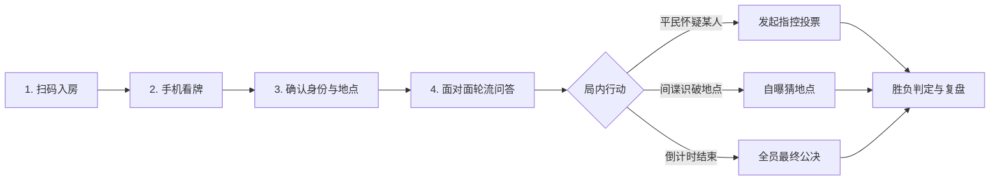
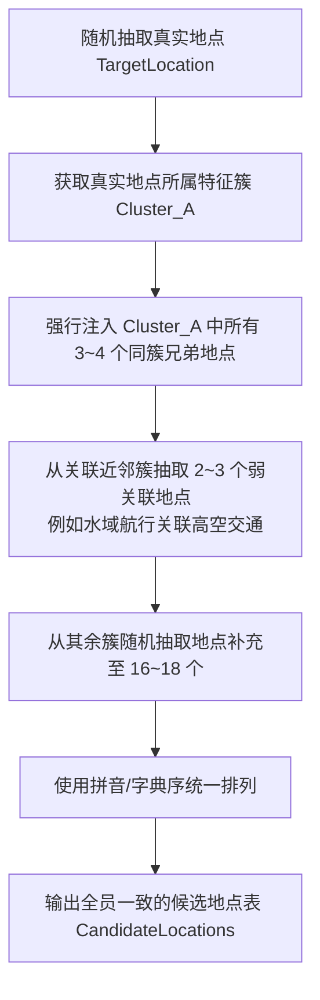

# 聚会游戏盒子·《间谍危机》（Spyfall）设计方案与实现规范

## 1. 概述与设计背景

《间谍危机》（Spyfall，又称《间谍密令》或《谁是间谍》）是一款基于语言推理、心理博弈和不对称信息的经典聚会社交桌游。

在本项目 `party-games`（聚会游戏盒子）中，游戏定位于**“线下聚会手机助手”**模式：
* 玩家在同一物理空间围坐，无需携带实体纸牌，手机扫码即入局。
* 手机端负责**绝密身份发牌脱敏、公开混淆候选地点排查板、精准倒计时托管、间谍随时自曝猜地点及平民指控投票**。
* 核心问答辩论由玩家面对面口头完成，兼顾沉浸感与聚会欢乐气氛。

---

## 2. 新手玩法说明与发问技巧指南

针对初次接触本游戏的新手玩家，前端大厅与游戏内常驻【📖 玩法规则与提问指南】浮窗，帮助新手快速掌握要领。

### 2.1 游戏基本流程



1. **看牌阶段**：
   * **平民**：屏幕显示本局【真实地点】（例如：综合医院）和【具体角色】（例如：主刀医生）。
   * **间谍**：屏幕醒目提示【⚠️ 你的身份是：间谍】，地点显示为【？？？未知】。
   * **共同信息**：所有玩家（包括间谍）都能看到一份包含 16~18 个地点的【候选地点参考表】。
2. **问答阶段（核心博弈）**：
   * 系统开局随机选定一名【首位提问人】。
   * 提问人可向在场**任意一名其他玩家**提出一个问题（例如：“*你今天来上班穿制服了吗？*”）。
   * 被提问人回答后，获得提问权，接着向下一位玩家提问（**注意：不可立刻回问刚才提问你的人**）。
   * 提问与回答均为玩家口头面对面交流，手机端后台平稳倒计时（默认 8 分钟）。
3. **结局触发机制**：
   * **间谍随时自曝猜地点**：间谍若在问答中猜出了真实地点，可在倒计时期间任何时刻点击手机【自曝猜地点】。若选对地点，间谍即刻获胜；选错则平民获胜。
   * **平民发起指控**：任何平民若极度怀疑某人是间谍，可点击【发起指控】暂停倒计时。若除被指控人外的所有玩家全票赞成，被指控人翻牌。若抓中真正间谍，平民获胜（间谍此时有最后一次猜地点的反击机会）；若抓错平民，间谍获胜。
   * **倒计时结束**：若 8 分钟倒计时归零仍未结局，全员进入最终投票表决，找出票数最多者指控。

---

### 2.2 新手发问技巧与避坑指南

#### 对于平民（Civilians）
* **核心目标**：向同伴发出只有在场同伴懂的“暗号”，同时不能让间谍听出具体是哪里。
* **反面教材（太直白）**：在“综合医院”问：“*你今天给病人做手术用了几号手术刀？*” $\rightarrow$ **间谍秒猜出是医院，平民送分！**
* **反面教材（太抽象）**：在“综合医院”问：“*你觉得今天天气怎么样？*” $\rightarrow$ **毫无营养，同伴无法证明身份，自己还可能被怀疑为在划水的间谍。**
* **模范范例（巧妙暗语）**：在“综合医院”问：“*你今天进门前有没有闻到那股熟悉的刺激性味道？*”或“*你平时的上班环境对安静程度要求高吗？*” $\rightarrow$ **同伴心领神会，而间谍听了可能觉得是医院、学校考场、图书馆或病毒研究所，依然迷茫。**

#### 对于间谍（Spy）
* **核心目标**：隐藏自己不被怀疑，顺着大家的问答“套话”，并对照候选列表暗中排除不可能的地点。
* **伪装话术**：回答尽量“留有余地”、“普适通用”。
  * 问：“*你觉得你现在周围吵不吵？*” $\rightarrow$ 答：“*时吵时不吵，有时候挺安静，有时候忙起来动静不小。*”
  * 问：“*你今天需要穿特定衣服吗？*” $\rightarrow$ 答：“*当然有规定要求，毕竟在这儿工作/待着马虎不得。*”
* **借力发问**：当轮到间谍提问时，可以向刚才回答精彩的平民发问，引诱对方讲出更多环境细节。

---

## 3. 特征重叠地点簇与动态近邻混淆池算法

针对“候选地点过于分散导致间谍秒崩”的问题，本系统设计了**特征重叠簇（Feature Clusters）**与**近邻混淆候选池算法（Semantic Closeness Pool Algorithm）**。

### 3.1 六大核心混淆特征簇设计

| 簇编号与名称 | 重叠环境特征 / 感官体验 | 预置地点与典型角色库 |
| :--- | :--- | :--- |
| **Cluster 1: 水域与航行** | 水体、摇晃颠簸、救生设备、封闭舱室、制服船员 | 1. **核潜艇**（艇长、声呐兵、鱼雷士官、随艇政委、水兵学员）<br>2. **加勒比海盗船**（独眼船长、大副、瞭望水手、火炮手、划桨奴工）<br>3. **豪华远洋游轮**（游轮船长、大堂经理、赌场荷官、客房管家、度假富豪）<br>4. **深海科考站**（站长、潜水员、海洋生物学家、深潜器操作员、实习生）<br>5. **跨海汽车渡轮**（渡轮舵手、汽车调度员、售票检票员、长途货车司机、游客） |
| **Cluster 2: 医疗与救治** | 白大褂、消毒水味、针剂针管、病床、安静与消毒要求 | 1. **三甲综合医院**（主刀医生、急救护士、麻醉师、住院患者、探视家属）<br>2. **精神康复中心**（精神科医师、心理咨询师、康复护工、特护病患、宿管保安）<br>3. **野战战地医院**（军医长官、战地护士、伤病伤员、担架搬运兵、随军神父）<br>4. **防疫隔离方舱**（消杀专员、核酸采样员、流行病学调查员、隔离人员、志愿者）<br>5. **高端医美诊所**（整形专家、咨询顾问、麻醉护士、VIP顾客、前台接待） |
| **Cluster 3: 高空与封闭交通** | 座位排号、安全带、广播播音、禁止吸烟、狭窄洗手间、安检 | 1. **民航客机**（机长、副驾驶、乘务长、经济舱空乘、商务舱乘客）<br>2. **国际空间站**（指令长、航天员、太空机械师、天体物理学者、太空游客）<br>3. **高铁商务车厢**（高铁司机、列车长、乘务员、商务座乘客、保洁员）<br>4. **跨国过夜大巴**（长途司机、轮换押运员、背包客、打工返乡人、打鼾乘客） |
| **Cluster 4: 保密与尖端科研** | 门禁指纹、通行证保密协议、精密仪器、白大褂、无尘要求 | 1. **绝密军事基地**（基地司令、雷达哨兵、密码破译员、重装特警、勤务兵）<br>2. **南极科学考察站**（科考站长、气象学家、冰川地质学者、柴油发电技工、越冬厨师）<br>3. **高等级病毒研究所**（首席科学家、P4实验员、生物安全官、灭菌技术员、实验助理）<br>4. **大型粒子对撞机中心**（理论物理学家、超导磁体工程师、数据监测员、安全巡检员） |
| **Cluster 5: 夜色与声色娱乐** | 昏暗灯光、酒水饮料、门票/手环、喧闹音乐、高消费 | 1. **地下酒吧夜总会**（调酒师、驻唱歌手、夜场DJ、VIP包厢客人、看场保镖）<br>2. **豪华大赌场**（筹码兑换员、二十一点荷官、巡场监察、豪赌狂客、便衣安保）<br>3. **沉浸式密室馆**（密室店长、机关控制员、NPC演员、解谜硬核玩家、尖叫新手）<br>4. **Livehouse音乐现场**（乐队主唱、贝斯手、调音师、狂热乐迷、前排保安） |
| **Cluster 6: 庄严肃穆与公共秩序** | 仪式感、正装制服、禁止喧哗走动、排队排号、严格流程 | 1. **法院审判庭**（主审法官、公诉人、辩护律师、书记员、被告人、法警）<br>2. **国家大剧院**（乐团首席指挥、第一小提琴手、歌剧演员、剧场引座员、观众）<br>3. **大型美术博物馆**（馆长、艺术策展人、文物修复师、巡馆保安、艺术系学生）<br>4. **大教堂婚礼现场**（主礼牧师、新郎、新娘、伴郎伴娘、婚礼摄影师） |

### 3.2 普适角色的伪装庇护机制

每个地点除特色角色外，固定包含 **普适角色（Universal Roles）**（如：安保员、保洁员、维修工、访客/顾客）。当平民抽到普适角色时，其回答天然具有模糊性，间谍可借此掩护自身，极大地丰富博弈层次。

### 3.3 动态近邻混淆池生成算法



* **统一排序（Canonical Ordering）**：候选表在下发给所有玩家（包括间谍）时，必须按固定的字母或拼音字典序排列。所有玩家手机屏幕上的布局完全相同，防止玩家通过瞄一眼对方屏幕的“色块位置”判定对方是平民还是间谍。

---

## 4. 技术架构与系统工程落地

### 4.1 目录结构与模块划分

```
party-games/
├── games/
│   └── spyfall/
│       ├── locations.js        # 地点簇配置、角色定义、近邻混淆池算法
│       └── server.js           # 服务端状态机、Socket.IO (/spyfall) 事件与严格脱敏
├── public/
│   └── spyfall/
│       ├── index.html          # Mobile-first 响应式单页
│       ├── style.css           # 深色特工霓虹暗黑主题样式
│       ├── client.js           # 前端业务逻辑（防窥长按、排查划线、倒计时、弹窗）
│       └── sfx.js              # Web Audio API 原生合成音效
└── server.js                   # 根服务路由挂载与大厅分流
```

### 4.2 服务端状态机与数据安全脱敏

#### 状态机枚举 (`PHASES`)
* `LOBBY`：等待玩家入座、房主调整游戏时长（5~12 分钟）。
* `PLAYING`：正常倒计时问答阶段（客户端本地可划线排查）。
* `PAUSED_ACCUSE`：某玩家发起指控，倒计时冻结，全场弹出表决窗。
* `SPY_GUESSING`：间谍主动自曝或被公决后最后的猜地点阶段（倒计时冻结）。
* `GAME_OVER`：胜负揭晓，公开真实地点、间谍身份及每位玩家角色，支持【再来一局】保留房间重置。

#### 数据脱敏规范 (`getSafePlayerView`)

服务端推送 `room_update` 时，必须针对 `playerId` 差异化序列化：

| 字段 | 平民客户端视角 | 间谍客户端视角 | 游戏结算复盘视角 (GAME_OVER) |
| :--- | :--- | :--- | :--- |
| `self.isSpy` | `false` | `true` | 真实标记 |
| `self.location` | 真实地点名（如“核潜艇”） | `null`（严格脱敏，不含任何线索） | 真实地点名 |
| `self.locationIcon` | 真实图标（如“⚓”） | `'❓'` | 真实图标 |
| `self.role` | 真实角色（如“声呐兵”） | `'间谍 (Spy)'` | 真实角色 |
| `players[i].role` | `'???'`（不可见他人身份） | `'???'`（不可见他人身份） | 公开全员真实角色 |
| `players[i].isSpy` | `undefined` | `undefined` | 真实公开谁是间谍 |
| `allLocations` | 统一排序的 16~18 个混淆候选列表 | 统一排序的 16~18 个混淆候选列表 | 统一候选列表 |

---

### 4.3 Socket.IO 通信契约规范

#### 客户端发送事件 (Client -> Server)

| 事件名 | 负载参数 | 描述 |
| :--- | :--- | :--- |
| `create_room` | `{ player: { name, avatar }, settings: { durationMinutes } }` | 创建间谍危机房间 |
| `join_room` | `{ roomCode, player: { id, name, avatar } }` | 加入房间，支持离线静默重连 |
| `start_game` | `{ roomCode }` | 仅房主可调用，人数 $\ge 3$ 人时发牌开局 |
| `initiate_accuse` | `{ targetPlayerId }` | 玩家发起指控，每人每局限 1 次，冻结倒计时 |
| `vote_accuse` | `{ agree: boolean }` | 其他玩家针对指控进行赞成/反对表决 |
| `spy_guess_location` | `{ locationId }` | 间谍自曝或最终反击，提交所猜测的地点 |
| `restart_game` | `{}` | 房主重开新对局 |

#### 服务端下发事件 (Server -> Client)

| 事件名 | 负载参数 | 描述 |
| :--- | :--- | :--- |
| `room_update` | 安全脱敏后的 `SafePlayerView` 对象 | 状态机变化、玩家进出、倒计时同步时广播 |
| `accuse_started` | `{ accuser: { id, name }, suspect: { id, name } }` | 广播指控开始，触发全员震动与表决弹窗 |
| `accuse_result` | `{ success: boolean, suspectIsSpy: boolean, ... }` | 广播表决结果 |
| `game_over_reveal` | 完整的复盘数据（真实地点、间谍、全员底牌） | 广播游戏结束与胜负结算 |

---

### 4.4 移动端核心交互细节

1. **“按住看牌”防偷窥卡牌（Hold-to-Reveal Card）**：
   * 默认呈现黑色绝密档案袋样式，大字标注“🔒 按住查看绝密身份”。
   * 触摸事件 `touchstart` / `mousedown` 触发解密透明，松开 `touchend` / `mouseup` 瞬间遮盖。
   * 离开屏幕或页面发生滚动时自动重置为遮罩状态，防止并排坐的邻座余光斜视。
2. **交互式排查板（Interactive Scratchpad）**：
   * 16~18 个候选地点卡片呈网格排布。
   * 支持玩家点击切换状态：`[正常] -> [置灰划线排除] -> [金色标星重点] -> [复原]`。
   * 该状态保存在浏览器本地（不上传服务器），间谍可以用其排除嫌疑地点，平民可用其构思发问。
3. **Screen Wake Lock 常亮保持**：
   * 问答过程通常持续数分钟，调用浏览器的 `navigator.wakeLock.request('screen')` 保证游戏期间屏幕不熄屏。
4. **轻量原生合成音效 (`sfx.js`)**：
   * 采用 Web Audio API 原生振荡器生成音效（包括发牌卡牌声、最后 60 秒滴答警报、指控警笛声、胜利欢呼声），无需外挂大体积 MP3 文件。

---

## 5. 测试与验证计划

1. **单元测试与逻辑验证 (`test_spyfall.js`)**：
   * 混淆候选池算法验证：验证各簇地点抽取、兄弟地点强制注入与候选池数量正确性。
   * 数据脱敏断言：断言间谍接收到的 `location` 必为 `null`，平民接收到的他人 `role` 必为 `'???'`。
   * 状态机流转测试：测试正常倒计时结束、平民指控成功/指控平民失败、间谍自曝猜中/猜错全路径。
2. **端到端集成验证**：
   * 启动 `server.js`，通过模拟客户端与无头浏览器验证 Socket 连接。
   * 验证大厅链接与手机端扫码直达。
